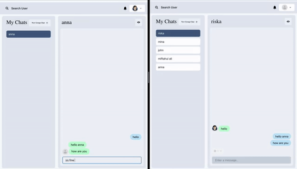

# Chit-Chat-App

Welcome to the Chit-Chat-App, a chat web application that leverages the power of Socket.io for real-time notifications and updates, this project also provide dark mode with chakra-ui as ui-framework.
# Feature backend and frontend
1. chakra-ui (responsive, darkmode)
2. mongodb
3. express
4. react
5. toastify
6. axios
7. react-notifiaction-badge
8. react-scrollable-feed
9. socket.io
10. framer-motion

# Prerequisites

Before you embark on your Chit-Chat journey, please ensure that you have the following prerequisites set up on your machine:

1. **Node.js**: If you haven't already, install Node.js. You can download it from nodejs.org.

2. **Git**: Make sure you have Git installed to easily clone the project repository.

# Clone the Repository

Let's start by cloning the Chit-Chat-App repository from GitHub. Open your terminal and execute the following command:

```bash
git clone https://github.com/alimmiftahul/Chit-Chat-apps.git
```

This will create a local copy of the project on your machine.

# Backend Setup

For the server-side configuration of the Chit-Chat web app, follow these steps:

1. Navigate to the server repository:

```bash
cd server
```

2. Install the necessary dependencies for the server:

```bash
npm install
```

3. Now, let's kickstart the server:

```bash

npm start
```

# Frontend Setup

For the frontend part of the Chit-Chat web app, here's what you need to do:

1. Navigate to the frontend repository:

```bash
cd frontend
```

2. Install the required dependencies for the frontend. You can choose between npm and yarn:

### Using npm:

```bash
npm install
```

### Using yarn:

```bash

yarn
```

3. Launch the project:

```bash

yarn run dev #or npm run dev
```

# Sample



Now, you're all set to embark on your Chit-Chat journey, connecting with others in real-time. Enjoy the experience of Chit-Chat! 🚀
